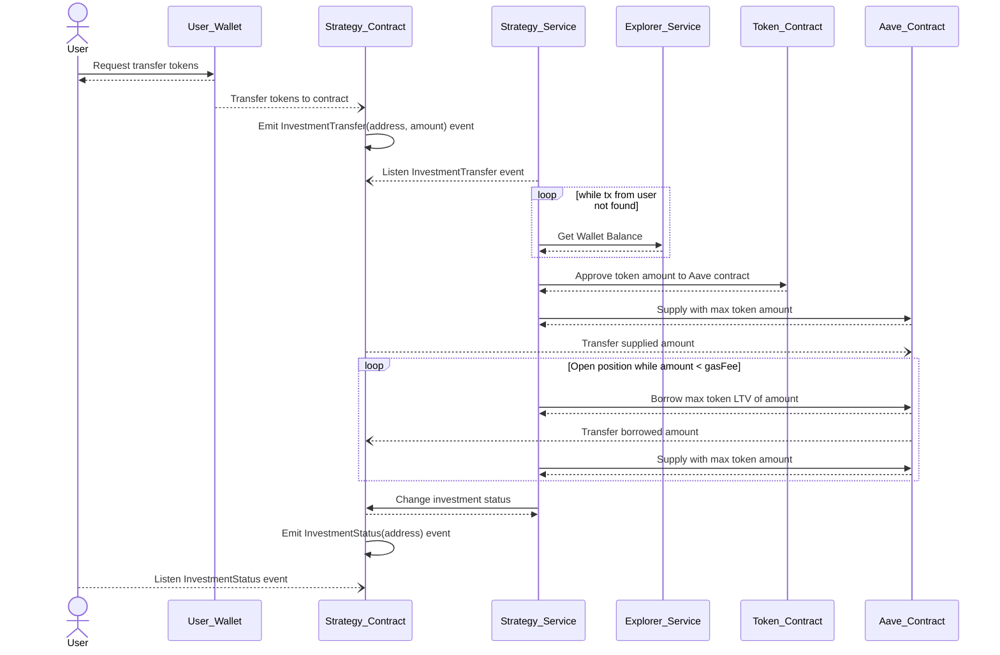

# Strategy Recursive Yield Farming

## Workflow

### Entering to the market

```mermaid
sequenceDiagram
    actor User
    User->>User_Wallet: Request transfer tokens
    User_Wallet-->>User: 
    User_Wallet--)Strategy_Contract: Transfer tokens to contract
    Strategy_Contract->>Strategy_Contract: Emit InvestmentTransfer(address, amount) event
    Strategy_Service--)Strategy_Contract: Listen InvestmentTransfer event

    loop while tx from user not found
        Strategy_Service->>Explorer_Service: Get Wallet Balance
        Explorer_Service-->>Strategy_Service: 
    end

    Strategy_Service->>Token_Contract: Approve token amount to Aave contract
    Token_Contract-->>Strategy_Service: 

    Strategy_Service->>Aave_Contract: Supply with max token amount
    Aave_Contract-->>Strategy_Service: 
    Strategy_Contract--)Aave_Contract: Transfer supplied amount

    loop Open position while amount < gasFee
        Strategy_Service->>Aave_Contract: Borrow max token LTV of amount
        Aave_Contract-->>Strategy_Service: 
        Aave_Contract--)Strategy_Contract: Transfer borrowed amount
        Strategy_Service->>Aave_Contract: Supply with max token amount
        Aave_Contract-->>Strategy_Service: 
    end

    Strategy_Service->>Strategy_Contract: Change investment status
    Strategy_Contract-->>Strategy_Service: 

    Strategy_Contract->>Strategy_Contract: Emit InvestmentStatus(address) event

    User--)Strategy_Contract: Listen InvestmentStatus event
```

### Leaving the market
